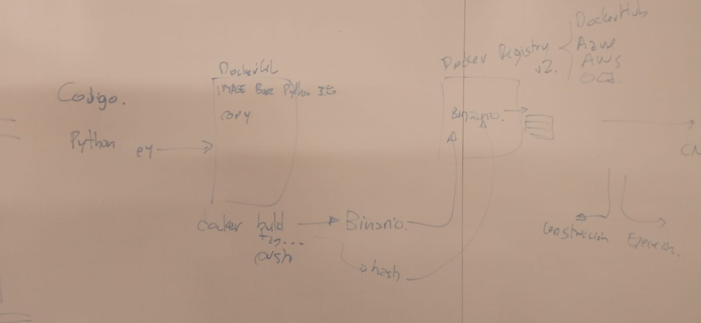
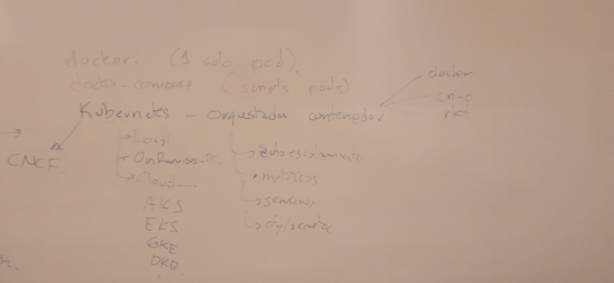

# Cloud Adoption Journey 2022

Oracle Academy

LAD Technology Knowledge

# Conceptos Basicos de Nube

Sesion 1 (02-09-2022)

[Francisco Moreno](francisco.m.moreno@oracle.com)

[Codigo](https://github.com/fmorenod81/OCI_TF)

[Presentacion](Cloud_Adoption_Journey_v1_02092022.pdf)

# Ofertas de Base de Datos

Sesion 2 (09-09-2022)

[Alfredo Miranda](alfredo.miranda@oracle.com)

[Presentacion](Database_Cloud_Options_ADB_v1_09092022.pdf)

Sesion 4 (23-09-2022)

[Francisco Moreno](francisco.m.moreno@oracle.com)

[Presentacion](OCI_Cloud Native_v5_23092022.pdf)

